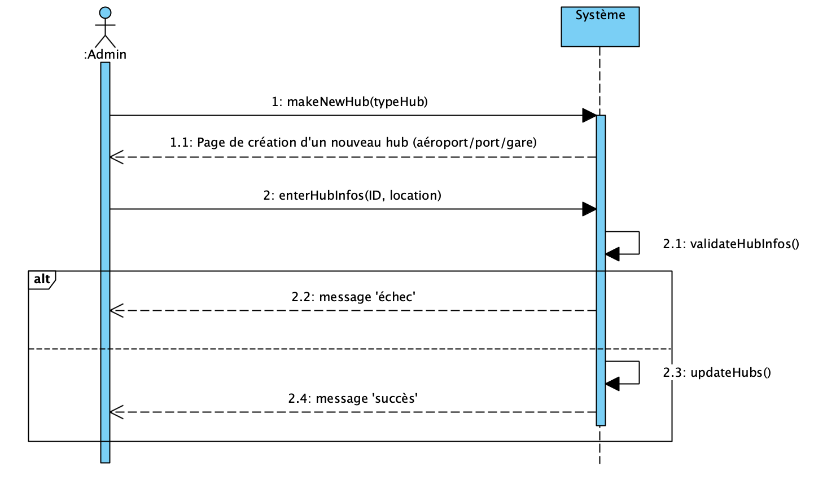
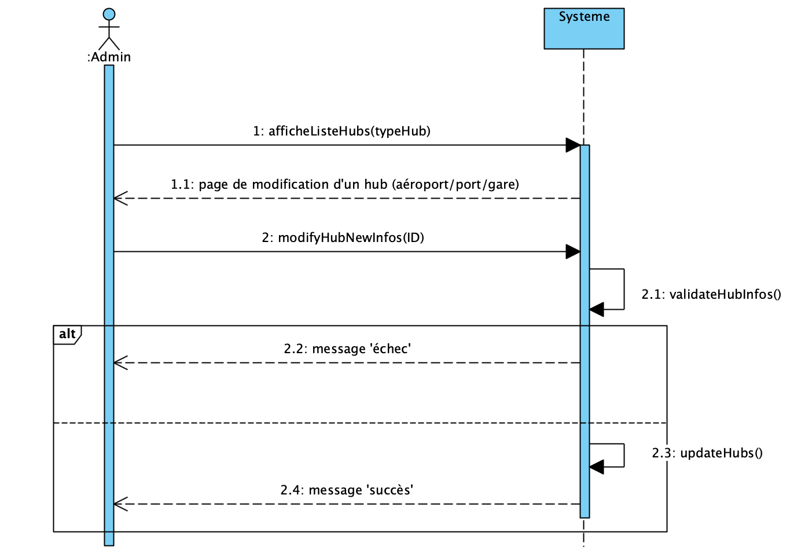
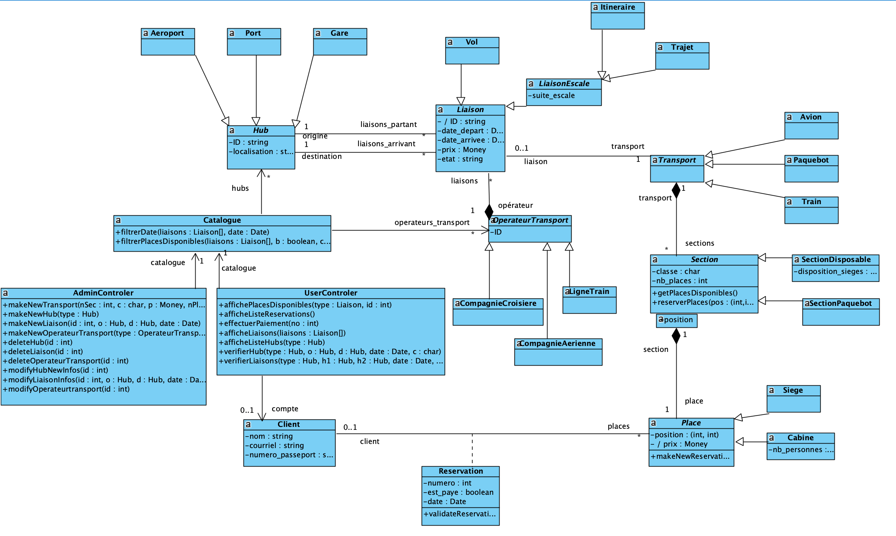
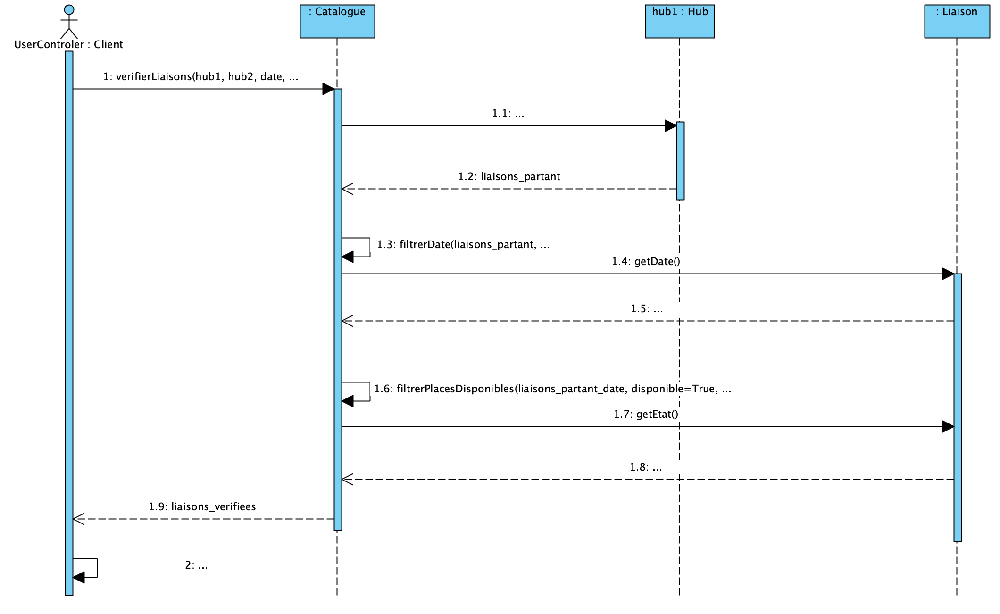

# IFT3911 - Hiver 2025 - Devoir 1  
**Système de Réservation de Voyages**

---

## Équipe Lilas

**Membres :**

- **Arman Nunez**  
  - *Matricule* : 20240160  
  - *Courriel* : [arman.nunez@umontreal.ca](mailto:arman.nunez@umontreal.ca)  
  - *Temps investi* : 25h

- **Byungsuk Min**  
  - *Matricule* : 20234231  
  - *Courriel* : [byungsuk.min@umontreal.ca](mailto:byungsuk.min@umontreal.ca)  
  - *Temps investi* : 33h

- **Shayan Nicolas Hollet**  
  - *Matricule* : 20146766  
  - *Courriel* : [shayan.nicolas.hollet@umontreal.ca](mailto:shayan.nicolas.hollet@umontreal.ca)  
  - *Temps investi* : 20h

**Soumissionnaire :** Shayan Nicolas Hollet

**Lien vers le dépôt GitHub :**  
[https://github.com/SweiiZen/IFT3911](https://github.com/SweiiZen/IFT3911)

---

## Description du Projet

Ce projet consiste à développer un logiciel de gestion de réservations pour trois modes de transport :  
- **Voyage aérien**
- **Voyage naval**
- **Voyage ferroviaire**

Le système comporte un **volet administratif** (création, modification, suppression et consultation des entités de transport et opérateurs) et un **volet client** (vérification des disponibilités, réservation et paiement).  
Les règles et contraintes (exprimées en OCL) garantissent notamment :
- L’unicité des identifiants (ex. : aéroports, ports, gares)
- La cohérence des données lors des opérations de réservation et de paiement  
- Des règles spécifiques pour la durée des itinéraires et la gestion des places

Pour plus de détails, veuillez consulter l’[énoncé du devoir](http://www-labs.iro.umontreal.ca/~syriani/courses/IFT3911-2025H/A1/A1.html).

---

## Structure du Projet

L’arborescence du projet est organisée comme suit :

```
.
├── Design
│   ├── images
│   │   ├── DG_logiciel.png
│   │   ├── DS_logiciel_paiement.png
│   │   ├── DS_logiciel_reservation.png
│   │   └── DS_logiciel_verif.png
│   ├── justifications
│   │   └── Justifications.txt
│   ├── ocl
│   │   └── contraintes_ocl.txt
│   └── vpp
│       ├── DGClasseLogiciel.vpp
│       └── DS
│           ├── paiement_place.vpp
│           └── reservation_place.vpp
├── Domaine
│   ├── images
│   │   ├── DG_classe_conceptuel.png
│   │   ├── DSS_admin_create_hub.png
│   │   ├── DSS_admin_create_liaison.png
│   │   ├── DSS_admin_create_operateur.png
│   │   ├── DSS_admin_create_transport.png
│   │   ├── DSS_admin_delete_hub.png
│   │   ├── DSS_admin_delete_liaison.png
│   │   ├── DSS_admin_delete_operateur.png
│   │   ├── DSS_admin_modify_hub.png
│   │   ├── DSS_admin_modify_liaison.png
│   │   ├── DSS_admin_modify_operateur.png
│   │   ├── DSS_client_paiement.png
│   │   ├── DSS_client_reservation.png
│   │   └── DSS_client_verif.png
│   └── vpp
│       └── DM1_diagrammeDeClasseConceptuel.vpp
├── README.md
└── rapport.html
```

> **Remarque :**  
> - Le dossier **Domaine** contient la conception du domaine (diagramme de classe conceptuel et diagrammes de séquence système – DSS).  
> - Le dossier **Design** regroupe le design logiciel complet (diagramme de classe, diagrammes de séquence/collaboration, diagramme de paquets), les contraintes OCL et les justifications.

---

## Contenu du Devoir

Le devoir se compose de quatre grandes tâches :

1. **Analyse et Conception du Domaine (30%)**  
   - *Diagramme de classes conceptuel*  
   - *Diagrammes de séquence système (DSS)* pour les scénarios administratifs et clients

2. **Design Logiciel (70%)**  
   - *Diagramme de classes logiciel*  
   - *Diagrammes de séquence ou de collaboration* pour les actions clients  
   - *Diagramme de paquets*  
   - *Contraintes en OCL* (pré/postconditions, règles d’intégrité)  
   - *Justifications du design* (règles du créateur, expert, couplage, cohésion, etc.)

Tous les détails (diagrammes, contraintes et justifications) sont présentés dans le [rapport.html](rapport.html) ainsi que dans les fichiers sources associés.

---

## Distribution des Tâches

| Tâche                | Arman | Byungsuk | Shayan |
|----------------------|:-----:|:--------:|:------:|
| **Analyse**          | 35%   | 35%      | 30%    |
| **Design**           | 50%   | 25%      | 25%    |
| **Contraintes**      |  0%   | 55%      | 45%    |
| **Justifications**   | 70%   | 30%      |  0%    |

Pour la répartition détaillée, reportez-vous à la section *Distribution des tâches* dans le [rapport.html](rapport.html).

---

## Diagrammes UML & Contraintes OCL

### Conception du Domaine

- **Diagramme de classe conceptuel :**  
    
  [Télécharger le fichier VP](Domaine/vpp/DM1_diagrammeDeClasseConceptuel.vpp)

- **Diagrammes de Séquence Système (DSS) :**  
  **Administration :**
  - Création, modification, suppression d’un hub  
      
      
    
  - Création, modification, suppression d’un opérateur  
      
      
    
  - Création, modification, suppression d’une liaison  
      
      
    
  - Création d’une section de transport  
    

  **Client :**
  - Vérification des disponibilités  
    
  - Réservation d’une place  
    
  - Paiement d’une place  
    

### Design Logiciel

- **Diagramme de classe logiciel :**  
    
  [Télécharger le fichier VP](Design/vpp/DGClasseLogiciel.vpp)

- **Diagrammes de Séquence Logiciel :**
  - Vérification (responsabilité d'Arman)  
    
  - Réservation (responsabilité de Byungsuk)  
    
  - Paiement (responsabilité de Shayan)  
    

- **Diagrammes de Paquets :**  
  Les diagrammes de paquets illustrant l’architecture modulaire du système sont documentés dans le rapport ainsi que dans les fichiers correspondants.

### Contraintes OCL

Les contraintes assurant l’intégrité du système (unicité des identifiants, règles de réservation et paiement, etc.) sont détaillées dans le [rapport.html](rapport.html) et dans le fichier suivant :  
`Design/ocl/contraintes_ocl.txt`.

---

## Justifications du Design

Les choix de conception (règles du créateur, expert, couplage, cohésion, etc.) ainsi que la justification détaillée des diagrammes se trouvent dans :
- Le fichier [Design/justifications/Justifications.txt](Design/justifications/Justifications.txt)  
- La section *Justifications* du [rapport.html](rapport.html).

## Remarques Finales

Pour toute question ou demande de clarification, veuillez consulter le [rapport.html](rapport.html) ou contacter l’un des membres de l’équipe.